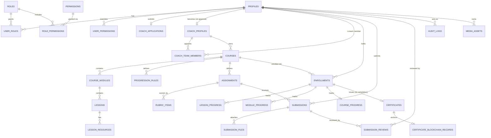

# Nexskill — Database Design

Postgres via Supabase. All tables use `uuid` primary keys (`default gen_random_uuid()`), `created_at`/`updated_at timestamptz default now()`, and soft-delete (`deleted_at timestamptz null`) on business records per §90 (users, courses, orders, certificates, submissions — never hard-deleted). RLS is enabled on every table; policies are summarized per table and fully defined in `supabase/migrations/`.

Money is stored as `amount_minor integer` (smallest currency unit) + `currency char(3)` (ISO 4217), never floating point (§84). Timestamps are always UTC `timestamptz`; user-local rendering happens in the UI using `profiles.timezone` (§83).

## 1. P0 core ERD

The diagram below covers only the tables implemented in the P0 vertical slice (§101). Full field lists follow. Tables outside P0 are listed in §3 with their status.

## 2. P0 table definitions

### Identity

**profiles** (1:1 with `auth.users`)
`id uuid PK/FK auth.users`, `display_name text`, `legal_name text` (private), `avatar_url text`, `bio text`, `country text`, `timezone text default 'UTC'`, `locale text default 'en'`, `status text check in ('active','suspended') default 'active'`, `created_at`, `updated_at`, `deleted_at`.
RLS: owner can read/update own row; public read of `display_name, avatar_url, bio, country` only via a `public_profiles` view; admin full access.

**roles** — `id, key text unique` (`guest`,`student`,`coach`,`sub_coach`,`org_owner`,`org_admin`,`support`,`finance_admin`,`content_moderator`,`super_admin`), `label`.

**permissions** — `id, key text unique` (e.g. `course.publish`, `course.unpublish`, `submission.review`, `submission.pass`, `payout.view`, `user.suspend`, `certificate.revoke`), `description`, `category`.

**role_permissions** — `role_id FK, permission_id FK`, unique (`role_id`,`permission_id`).

**user_roles** — `user_id FK profiles, role_id FK roles`, unique (`user_id`,`role_id`). A user's role set is arbitrary many — e.g. a person can be both `student` and `coach`.

**user_permissions** — `user_id FK, permission_id FK, effect text check in ('grant','revoke')`. Resolved after role defaults; lets admin grant/revoke a capability for one user without a new role.

### Coaching

**coach_applications** — `id, applicant_id FK profiles, public_name text, legal_name text, country text, bio text, expertise text[], years_experience int, qualifications text, portfolio_url text, social_links jsonb, proposed_categories text[], status text check in ('draft','submitted','under_review','additional_information_required','approved','rejected','suspended') default 'draft', reviewed_by FK profiles, reviewed_at, review_notes text`.
RLS: applicant reads/writes own draft; admin (`coach.review` permission) reads/updates all.

**coach_profiles** — `id, user_id FK profiles unique, slug text unique, headline text, verified boolean default false, status text check in ('active','suspended') default 'active', default_commission_rate numeric(5,4)` (nullable → falls back to `platform_settings.default_commission_rate`; never a hardcoded constant, §38). Created when a `coach_applications` row transitions to `approved`.

**coach_team_members** — `id, coach_profile_id FK, member_id FK profiles, scope_type text check in ('account','course','cohort','module','student_group'), scope_id uuid null` (null when `scope_type='account'`), `permission_keys text[]`, `status text check in ('active','revoked') default 'active'`, `invited_by FK profiles`.
RLS: `coach_profile_id` owner manages rows; `member_id` can read own grants; resource-scoped permission checks (§4 of architecture doc) query this table directly, so revocation here takes effect immediately with no cache to invalidate (§105).

### Learning (curriculum)

**courses** — `id, coach_profile_id FK, title text, slug text unique, subtitle text, description text, category_id FK categories, level text check in ('beginner','intermediate','advanced','all_levels'), primary_language text default 'en', course_type text check in ('self_paced','mentored','live','hybrid','cohort','certification','private','organization'), pricing_model text check in ('free','paid') default 'free', price_amount_minor int default 0, price_currency char(3) default 'USD', access_duration_days int null` (null = lifetime — never a hardcoded `180`, §43), `ai_assistant_enabled boolean default false, status text check in ('draft','submitted_for_review','under_review','approved','published','rejected','unpublished','archived') default 'draft', published_version_id uuid null FK course_versions, thumbnail_media_id FK media_assets`.
RLS: owning coach + team members with course scope manage; public reads only `status='published'` rows; admin full access.

**course_versions** — `id, course_id FK, version_number int, snapshot jsonb, published_at, created_by FK profiles`. Publishing a course snapshots the curriculum so an in-progress student's structure doesn't shift under them mid-course (§88); enrollments reference the version active at enrollment time via `enrollments.course_version_id`.

**categories** — `id, name text, slug text unique, parent_id FK categories null` (self-referencing → subcategories, DB-driven per §19, never hardcoded in UI).

**course_modules** — `id, course_id FK, title text, position int, description text`.

**lessons** — `id, module_id FK, title text, position int, lesson_type text check in ('video','rich_text','image_gallery','audio','pdf','file_download','presentation','external_resource','quiz','exam','practical_assignment','live_class','discussion','project','checklist','survey'), content jsonb` (shape depends on `lesson_type`; kept component-based per §11 so new types don't require a schema migration for their container), `assignment_id FK assignments null`, `estimated_minutes int null`.

**lesson_resources** — `id, lesson_id FK, media_id FK media_assets, label text`.

**progression_rules** — `id, course_id FK, target_type text check in ('module','lesson'), target_id uuid, rule_type text check in ('open','sequential','assignment_gated','score_gated','instructor_gated','date_gated','cohort_gated'), config jsonb` (e.g. `{"min_score": 80}` for `score_gated`, `{"unlock_at": "2026-09-01T00:00:00Z"}` for `date_gated`). Rules are data, never `if` statements per lesson (§75 "no hardcoded business rules").

### Enrollment & progress

**enrollments** — `id, student_id FK profiles, course_id FK, course_version_id FK course_versions, cohort_id FK cohorts null, enrollment_source text check in ('purchase','free','admin_grant','organization','coupon','scholarship','invitation'), started_at, expires_at null, status text check in ('active','completed','expired','suspended','cancelled') default 'active', completed_at null`.
Unique (`student_id`,`course_id`) where `status != 'cancelled'`.
RLS: student reads own; owning coach/team with scope reads students of their course; admin all.

**lesson_progress** — `id, enrollment_id FK, lesson_id FK, status text check in ('not_started','in_progress','completed') default 'not_started', completed_at null`. Unique (`enrollment_id`,`lesson_id`).

**module_progress** — `id, enrollment_id FK, module_id FK, status text check in ('locked','unlocked','completed') default 'locked', unlocked_at, completed_at`. Unique (`enrollment_id`,`module_id`). `status` transitions are computed by the progression engine (`lib/domains/learning/progression.ts`) from `progression_rules` + `lesson_progress`/submission state — never set directly from the client.

**course_progress** — `id, enrollment_id FK unique, percent numeric(5,2) default 0, completion_rule_snapshot jsonb, completed_at null`. `completion_rule_snapshot` is a copy of the course's completion rules (§33) at enrollment time, so a later rule change doesn't retroactively fail a student who already completed under the old rule.

### Assessment

**assignments** — `id, course_id FK, lesson_id FK null, title text, instructions text, demonstration_media_ids uuid[], reference_file_media_ids uuid[], required_submission_types text[] check (subset of {'photo','video','pdf','document','text','audio'}), max_attempts int null, due_at timestamptz null, passing_criteria jsonb` (e.g. `{"type":"rubric","min_total":80}` or `{"type":"pass_fail"}`).

**rubric_items** — `id, assignment_id FK, label text, max_points int, position int`.

**submissions** — `id, assignment_id FK, enrollment_id FK, student_id FK, attempt_number int, status text check in ('draft','submitted','in_review','revision_required','passed','failed') default 'draft', submitted_at null`. Unique (`assignment_id`,`enrollment_id`,`attempt_number`) — **never overwritten**; a resubmission is a new row with `attempt_number + 1`, preserving full history (§13).

**submission_files** — `id, submission_id FK, media_id FK media_assets, submission_type text`.

**submission_reviews** — `id, submission_id FK, reviewer_id FK profiles, decision text check in ('revision_required','passed','failed'), written_feedback text, rubric_scores jsonb, reviewed_at`.
RLS: reviewer must hold `submission.review` for the assignment's course (owner coach, or scoped sub-coach, or admin) — enforced in the domain function, mirrored in RLS using a `has_course_permission(course_id, permission_key)` SQL function so policy and application logic can't drift apart.

**quizzes / quiz_questions / quiz_options / quiz_attempts / quiz_answers** — modeled, not built in P0 (lesson_type `quiz` renders a "coming soon" state until built in P1). Schema shape documented so the `lesson_type` enum above doesn't need to change later.

### Certification

**certificates** — `id, enrollment_id FK unique, certificate_number text unique` (e.g. `NXS-{CATEGORY}-{YEAR}-{RANDOM6}`), `student_id FK, course_id FK, coach_profile_id FK, issued_at, expires_at null, status text check in ('pending','issued','revoked') default 'pending', revoked_at null, revoked_by FK profiles null, revoked_reason text null` (internal; not necessarily shown publicly, §87), `payload_hash text`, `pdf_media_id FK media_assets null`.

**certificate_blockchain_records** — `id, certificate_id FK unique, chain text null, transaction_hash text null, block_reference text null, anchored_at timestamptz null, verification_status text check in ('unanchored','pending','anchored','failed') default 'unanchored'`. Certificate issuance never blocks on this row — it starts `unanchored` and a background job promotes it (§35, §104).

Public verification (`/verify/[certificateId]`) reads only: course title, student display name, coach name, issue date, status, and (if anchored) the chain reference — never legal name, email, or payment info.

### Media & system

**media_assets** — `id, owner_id FK profiles, provider text, provider_asset_id text, asset_type text check in ('image','video','audio','document'), title text, duration_seconds int null, thumbnail_url text null, processing_status text check in ('pending','ready','failed') default 'ready', storage_bucket text, storage_path text, metadata jsonb`.

**audit_logs** — `id, actor_id FK profiles null, action text, target_type text, target_id uuid null, previous_state jsonb null, new_state jsonb null, ip_address inet null, created_at`. No update/delete policy for any non-superadmin role — append-only (§49).

**platform_settings** — `id, key text unique, value jsonb, category text, is_secret boolean default false`. Secret-flagged rows are never returned by the general settings read API (§86); actual secrets live in env vars regardless — this table is for tunable business config (default commission rate, default access duration, coach-approval-required toggle), not credentials.

**background_jobs** — see architecture doc §7.

## 3. Domains modeled but not built in P0

Full field-level design is deferred to the P1/P2 implementation task that builds each domain, to avoid designing schema for rules that will change once real usage patterns exist. Each is still named here so the P0 schema's foreign keys and enums (e.g. `enrollment_source`, `course_type`) already anticipate them without a breaking migration later:

- **Organizations** (§6, §55): `organizations, organization_members, organization_teams, organization_seats, organization_course_assignments` — `enrollment_source='organization'` already reserved.
- **Commerce** (§37–41): `products, course_prices, orders, order_items, payments, refunds, coupons, coupon_redemptions, commission_rules, financial_ledger, instructor_earnings, payouts` — `courses.price_amount_minor/currency` already reserved; `enrollment_source='purchase'/'coupon'/'scholarship'` already reserved.
- **Live learning** (§24, §44–45): `cohorts, cohort_students, live_sessions, attendance` — `enrollments.cohort_id`, `progression_rules.rule_type='cohort_gated'`, `lessons.lesson_type='live_class'` already reserved.
- **Communication** (§26–27, §29): `conversations, conversation_members, messages, announcements, notifications, notification_preferences`.
- **Community** (§28): `communities, community_members, posts, comments, reactions, reports`.
- **Reviews** (§23): `course_reviews, instructor_reviews`.
- **Feature flags** (§71): `feature_flags` (simple `key, enabled, rollout_rule jsonb`).

## 4. Indexing notes

- Every FK column is indexed.
- `courses(status, category_id)` composite for marketplace listing (P1) — created now since it's cheap and avoids a later hot-path migration.
- `submissions(assignment_id, enrollment_id, status)` for the review queue's "waiting for review" filter.
- `enrollments(student_id, status)` and `enrollments(course_id, status)` for dashboard aggregates.
- `certificates(certificate_number)` unique index backs the public verification lookup.

## 5. RLS strategy summary

Default-deny. Every table gets: owner-read/write policy where an owner column exists; a `has_permission(auth.uid(), 'x.y')` or `has_course_permission(auth.uid(), course_id, 'x.y')` SQL helper function backing coach/sub-coach/admin policies; a narrow public-read policy only on tables with an explicit public surface (`courses` where `status='published'`, `certificates`+`certificate_blockchain_records` via the verification path only, `public_profiles` view). No table is world-readable by default.
