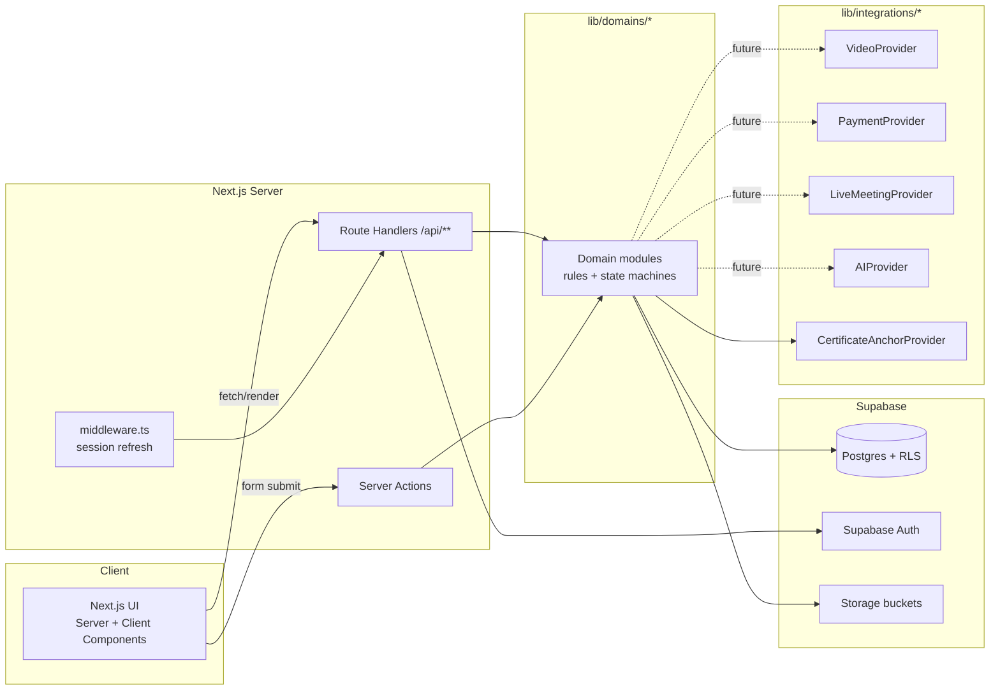

# Nexskill — System Architecture

## 1. Stack

- **Frontend/Backend:** Next.js 14 (App Router), TypeScript (strict), Tailwind CSS. Server Components for data-heavy pages, Route Handlers (`app/api/**/route.ts`) for domain actions, Server Actions for form mutations where it keeps things simpler than a route handler.
- **Database/Auth/Storage:** Supabase — Postgres 15, Supabase Auth (email/password + OAuth-ready), Supabase Storage (private buckets for submissions/certificates, public bucket for marketing assets), Postgres Row-Level Security as the authorization backstop.
- **Background jobs:** Not available as a managed queue in P0 (no Redis/worker infra provisioned yet). Modeled via a `background_jobs` table + a `POST /api/jobs/run` cron-triggered drain endpoint (Vercel Cron or Supabase Scheduled Functions in production). Certificate issuance runs synchronously in P0 with the blockchain-anchor step deferred to this job table so a slow/absent chain integration never blocks certificate creation.
- **Deployment target:** Vercel (frontend/API) + Supabase (managed Postgres/Auth/Storage). No infra-as-code is created in P0; this doc records the intended shape so it isn't improvised later.

This matches the spec's own recommended stack (§53) and is not a deviation.

## 2. Domain boundaries

Per §98, the codebase is organized by domain, not by technical layer, under `lib/domains/*`. Each domain owns its database access and business rules; UI code never queries Supabase directly for anything beyond simple reads — writes and rule enforcement go through a domain module.

```
Identity        → users, profiles, roles, permissions, sessions
Coaching        → coach_profiles, coach_applications, coach_team_members
Organization    → organizations, org_members, org_seats           (P2)
Learning        → courses, modules, lessons, progression_rules
Enrollment      → enrollments, lesson_progress, module_progress, course_progress
Assessment      → assignments, submissions, reviews, rubrics, quizzes
Live            → cohorts, live_sessions, attendance                (P1)
Communication   → conversations, messages, announcements, notifications (P1)
Community       → communities, posts, comments                     (P2)
Commerce        → orders, payments, coupons, earnings, payouts     (P1)
Certification   → certificates, certificate_verifications, cert_blockchain_records
Media           → media_assets, uploads
Reviews         → course_reviews, instructor_reviews               (P1)
System          → audit_logs, platform_settings, feature_flags, background_jobs
```

A domain module exposes typed functions (`enrollStudent()`, `passSubmission()`, `publishCourse()`) — never raw table CRUD — so permission checks and state-machine rules live in one place per §61 ("avoid insecure generic CRUD APIs for sensitive business operations").

## 3. High-level request flow



## 4. AuthN / AuthZ model

- **Authentication:** Supabase Auth issues a JWT (access + refresh token) stored in httpOnly cookies via `@supabase/ssr`. `middleware.ts` refreshes the session on every request.
- **Identity vs. role:** `profiles` (1:1 with `auth.users`) holds public identity. `user_roles` is a many-to-many join (`user_id`, `role_id`) — **never** a single `role` enum column on `users`, per §4's explicit instruction to avoid `role = student/teacher/admin`.
- **Granular permissions:** `permissions` is a static catalog of capability strings (e.g. `course.publish`, `submission.review`, `payout.view`). `role_permissions` maps default permissions per role. `user_permissions` allows per-user grants/revokes that override the role default — this is the mechanism sub-coach scoped access (§5) is built on.
- **Scoped grants:** Sub-coach access is not a role alone; it's a row in `coach_team_members` carrying a `scope_type` (`account` | `course` | `cohort` | `module` | `student_group`) and `scope_id`, plus a set of granted permission keys. Every domain function that a sub-coach might call resolves effective permissions as: role defaults → user overrides → scoped team-member grants for the specific resource being touched. See `docs/roles-permissions.md`.
- **Server-side enforcement:** Every domain module function starts by resolving the caller's effective permission for the specific resource (not just "is coach"). RLS policies in Postgres are the second, independent enforcement layer — the app must remain correct even if a route handler forgets a check. **Frontend hides UI; it never grants access.**
- **Resource-level checks example:** `passSubmission(submissionId, actorId)` loads the submission's course, resolves `actorId`'s permission for `submission.grade` scoped to that course (owner instructor, or sub-coach with `course` scope including that course, or admin), and rejects otherwise — this is what satisfies the §105/§68 requirement that Sub-Coach A cannot grade Course B's submissions.

## 5. Storage & media

- `media_assets` is a provider-independent record (§25): `provider`, `provider_asset_id`, `asset_type`, `processing_status`. P0 uses Supabase Storage as the "provider" for images/PDFs/small clips; a dedicated `VideoProvider` adapter (Vimeo/Mux-class service) is documented but not wired until a credential is supplied — course video lessons render a "video pending provider configuration" state rather than a broken player.
- Buckets: `public-assets` (course thumbnails, profile photos — public read), `submissions` (student assignment uploads — private, signed URL only, scoped by RLS to the student + authorized coaches), `certificates` (generated PDFs — public read via unguessable path, since certificates are meant to be shareable, but the *verification data* is served from the database, not trusted from the file).
- Uploads are validated server-side: extension allow-list, MIME sniffing (not just the client-reported MIME), max size per asset type, before a signed upload URL is issued. Student submissions are never placed in a publicly listable bucket.

## 6. Integration adapters (§64, §97)

Interfaces live in `lib/integrations/*/types.ts`; a concrete provider implements the interface; a factory picks the implementation from `platform_settings`/env. This is what lets Nexskill swap Google Meet → native live, or Vimeo → another host, without touching call sites.

| Adapter | P0 implementation | Real provider (later) |
|---|---|---|
| `LiveMeetingProvider` | Not called (live classes are P1) | Google Workspace `live@nexskill.com` service account → Meet |
| `VideoProvider` | Not called (video lessons show "pending" state) | Vimeo/Mux |
| `PaymentProvider` | Not called (enrollment is free/admin-grant only) | Card gateway / PH gateway |
| `EmailProvider` | Console/log stub in dev | Transactional email (Resend/SES-class) |
| `AIProvider` | Not called | Claude via Anthropic API, course-scoped retrieval |
| `CertificateAnchorProvider` | No-op implementation that marks `verification_status = 'unanchored'` immediately — certificate issuance never blocks on this | Low-cost chain integration |
| `StorageProvider` | Supabase Storage | Same, or swappable |

Each adapter is a plain TypeScript interface with one server-only implementation module; no provider SDK is imported outside `lib/integrations/**`.

## 7. Background jobs

`background_jobs` table: `id, type, payload jsonb, status, attempts, max_attempts, run_after, last_error, created_at`. A single `runDueJobs()` function processes due jobs with per-type handlers (`issue_certificate_anchor`, `send_email`, …), retrying with backoff up to `max_attempts` and logging failures rather than throwing. In production this is invoked by a scheduled trigger; there is no long-running worker process in P0.

## 8. Security boundaries (§50, §107)

- All privileged mutations go through domain modules that re-check permissions server-side — confirmed in code review before any phase is called done, not assumed from the UI.
- RLS is enabled on every table from the first migration; default-deny, explicit policies per role/ownership.
- File uploads: extension + MIME + size validated before signed URL issuance (§57).
- Secrets live in environment variables only (`.env.local`, Vercel project env) — never in `platform_settings` rows readable by non-admins (§86).
- Input validation with `zod` schemas at every route handler / server action boundary; domain functions assume validated input, matching "only validate at system boundaries."
- Audit log (`audit_logs`) is written by domain functions for sensitive actions (coach approval, course publish/unpublish, certificate revoke, refund, role change) — the log itself has no update/delete RLS policy for non-superadmins.
- Payment webhooks (P1) will store `provider_event_id` with a unique constraint so redelivery is a no-op — documented now so it isn't improvised later (§62, §91).

## 9. Multi-tenancy (§52)

Three tenancy boundaries are modeled from the first migration even though only the first is exercised in P0:

1. **Platform** — Nexskill itself (admin scope).
2. **Instructor business** — a `coach_profiles.id` is the tenant key for courses, students-of-that-coach, team members, earnings. RLS policies scope coach-authored tables by this key.
3. **Organization** — `organizations.id` (P2) scopes seats/members/assignments; an org never sees another org's rows, enforced by RLS, not just query filters.

## 10. Deployment (local dev, since this environment has no Node.js)

```bash
# one-time
cd nexskill
npm install
cp .env.example .env.local   # fill in Supabase project URL/keys
npx supabase db push          # applies supabase/migrations/*.sql to your Supabase project
npm run db:seed               # loads docs-defined seed data

# day to day
npm run dev                   # http://localhost:3000
npm run typecheck
npm run lint
npm run test
```

Production: connect the repo to Vercel, set the same env vars in the Vercel project, point `NEXT_PUBLIC_SUPABASE_URL`/keys at the production Supabase project, and run migrations via `supabase db push --linked` (or the Supabase migration GitHub Action) as part of deploy — not manually against prod (§76).
