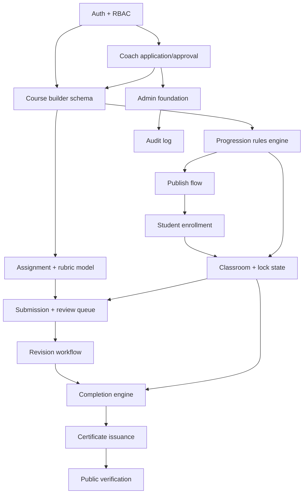

# Nexskill — Roadmap & Implementation Sequence

## Priority definitions

- **P0** — required for the first working vertical slice (§101 of the spec). Nothing here is mocked; every P0 item is real UI → API → DB → permissions.
- **P1** — required shortly after launch to make the platform commercially real (payments, marketplace discovery, live classes, messaging, sub-coach UI, org phase 1).
- **P2** — future (community, AI, gamification, full org suite, native mobile).

This mirrors spec §72's nine phases, compressed: Phases 1–3 = P0, Phases 4–6 = P1, Phases 7–9 split across P1 (certificates are P0, actually — see below) and P2.

**Deviation from spec's phase order, and why:** §72 lists Certification as Phase 7 (after Marketplace/Live/Business phases). But §101's vertical slice — which the spec itself calls the proof that "the core Nexskill architecture is proving itself" — ends with certificate issuance. Certificates are pulled into P0 so the first slice is actually complete end-to-end, rather than stopping at "course completed" with no credential. Marketplace discovery, payments, and live classes move to P1 since the vertical slice explicitly uses free/admin-granted enrollment and doesn't require them.

## P0 — Platform foundation + LMS core + practical learning + certification

Epic: **Coach can build and grade a real course; a student can complete it and receive a verifiable certificate.**

| # | Feature | Task | Acceptance criteria |
|---|---|---|---|
| 1 | Repo & infra | Scaffold Next.js/TS/Tailwind/Supabase project, env config, base layout, design tokens | `npm run dev` boots (once Node installed); no secrets in repo |
| 2 | DB schema | Migrations for identity, coaching, learning, enrollment, assessment, certification tables + RLS | `supabase db push` applies cleanly; RLS default-deny verified |
| 3 | Auth | Register/login/logout, session middleware, profile creation trigger | New user gets a `profiles` row automatically; protected routes redirect when signed out |
| 4 | RBAC | Roles/permissions seed, permission resolver (`lib/domains/identity/permissions.ts`) | Unit tests cover role default, user override, sub-coach scope, revoke-wins-over-grant |
| 5 | Coach application | Apply form, admin review queue, approve/reject | Approval creates `coach_profiles`; rejected applicant sees status, can't access Coach Studio |
| 6 | Course builder | Create course, modules, lessons (subset of lesson types: rich_text, video-pending, practical_assignment), assignments, progression rules (sequential + assignment_gated) | Coach can build the demo course end to end from `/coach/courses/new` |
| 7 | Publish flow | Draft → submitted → published (auto-approve toggle in `platform_settings` for P0 so admin isn't a hard blocker in dev/demo) | Published course appears on `/courses`; draft does not |
| 8 | Student enrollment | Register, enroll (free path), redirected into classroom | Enrollment row created; duplicate enroll blocked |
| 9 | Classroom | Curriculum sidebar with lock state, lesson viewer, mark-complete | Locked lesson returns 403 if URL is hit directly (§102) |
| 10 | Progression engine | Sequential + assignment-gated rule evaluation, module unlock on pass | Passing an assignment unlocks the next module; failing/revision does not |
| 11 | Assignment submission | Upload files (photo/video/pdf/text), draft → submitted, full attempt history | Resubmission creates a new row, never overwrites (§13) |
| 12 | Review queue | Coach sees submitted/resubmitted items across owned courses, opens one, scores rubric, decides | Sub-coach with course-scoped grant sees only that course's queue (§105) |
| 13 | Revision workflow | request-revision → student resubmits → back in queue | Original submission preserved; feedback visible to student |
| 14 | Course completion | Rule-driven (`course_progress.completion_rule_snapshot`), not `progress==100%` literal | Completing all required lessons + passing assignment marks `enrollments.status='completed'` |
| 15 | Certificate issuance | Generate on completion, unique ID, QR, PDF | Certificate row `status='issued'` immediately; blockchain anchor queued, not blocking (§104) |
| 16 | Public verification | `/verify/[certificateId]` works signed-out | Shows valid/revoked/expired correctly; revoked cert never shows as valid |
| 17 | Admin foundation | Coach approval queue, user suspend, basic settings | Suspended user loses classroom/coach access immediately (§68) |
| 18 | Audit log | Writes on: coach approve/reject, course publish/unpublish, certificate revoke, user suspend | Rows are append-only (no UPDATE/DELETE policy) |
| 19 | Seed data | Admin, 2 coaches, several students, demo course (Professional Microblading Fundamentals — theory → practice → assignment → review → advanced → final assessment → certificate) matching §78, clearly marked as seed | `npm run db:seed` idempotent |
| 20 | Tests | Permission negative-tests (§68/§105), progression-lock test, submission-history-preserved test | `npm run test` passes |

## P1 — Marketplace, commerce, live, communication, coach business

| Feature | Depends on |
|---|---|
| Course discovery, search/filters, sales pages, instructor public profiles | P0 courses/coach_profiles |
| Checkout: `PaymentProvider` real implementation, orders, commission snapshot, coupons | P0 enrollment model (source='purchase' already reserved) |
| Instructor earnings ledger, payout requests | Checkout |
| Live classes: `LiveMeetingProvider` (Google Meet via `live@nexskill.com`), cohorts, attendance | P0 course model |
| Messaging (student↔coach), announcements, notification center | P0 identity |
| Sub-coach management UI (`/coach/team`) | P0 `coach_team_members` schema + permission resolver (already built) |
| Reviews (course/instructor) | P0 enrollment/completion |
| Organization phase 1: seats, invite, assign course, basic reporting | P0 course/enrollment model |
| Admin: full course moderation, financial ops, support tickets | P0 admin foundation |
| Quizzes/exams (lesson_type already reserved) | P0 lesson/assignment engine |
| SEO: server-rendered public pages, sitemap, structured data | P1 marketplace pages |
| Feature flags | Any P1 rollout |

## P2 — Intelligence, community, full org suite, native mobile

- AI Study Assistant + AI Coach tools (`AIProvider` real implementation, course-scoped retrieval authorization)
- Community spaces, posts/comments/moderation
- Full organization suite: teams, departments, franchise/white-label groundwork
- Learning analytics, risk indicators, gamification (kept professional per §48)
- Instructor storefront subdomains, white-label
- Native mobile (React Native/Expo) against the same domain APIs
- Native live video (in addition to Google Meet)

## Dependency order (why this sequence)

Auth/RBAC gates everything (nothing can be permission-checked without it). Coach approval must exist before course authoring is meaningful. Progression rules and the assignment/rubric model are siblings that both feed the classroom lock state and the review queue. Certificates are the terminal node — they can't be built before completion, which can't be built before the review queue closes the loop.

## Definition of done (applies to every item above, per §108)

UI works · backend works · DB persists correctly · authorization enforced server-side · input validated · loading/error states exist · responsive at 375/390/tablet/desktop · relevant tests pass · docs updated. A route existing with a working-looking button is not "done" if the button doesn't reach the database.
